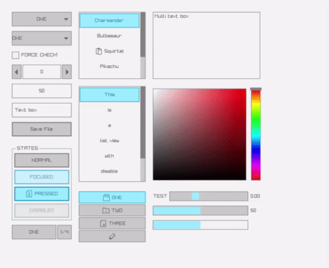

# raylib-ocaml

OCaml bindings for <a href="https://www.raylib.com/" target="_blank">raylib</a>
(6.0.0), a simple and easy-to-use library to enjoy videogames programming.

The documentation can be viewed [online](https://tjammer.github.io/raylib-ocaml/raylib/Raylib/index.html).

The bindings are pretty faithful to the original C code, the biggest difference is the conversion of all function names from CamelCase to snake_case.
Wherever possible, integer arguments are changed to their own variant types, eg. `int key` to `Key.t`.

Bindings exist for (nearly) all functions and types, but only a subset are tested thus far (see examples folder). Contributions are welcome.

## Example

``` ocaml
let setup () =
  Raylib.init_window 800 450 "raylib [core] example - basic window";
  Raylib.set_target_fps 60

let loop () =
  let open Raylib in
  while not (window_should_close ()) do
    begin_drawing ();
    clear_background Color.raywhite;
    draw_text "Congrats! You created your first window!" 190 200 20
      Color.lightgray;
    end_drawing ()
  done;
  close_window ()

let () = setup () |> loop
```
More examples can be found in the examples folder.

Although the original raylib is written in C, most functions take their arguments by value, which maps nicely to a functional language like OCaml. In the few cases where pointers are needed for arrays (mainly the 3D part of raylib), raylib-ocaml tries to use the `CArray` type of ctypes, which it also re-exports in the main `Raylib` module.

## Installation

During the build of raylib-ocaml, the raylib C library is built from source, therefore its dependencies must be installed (<a href="https://github.com/raysan5/raylib/wiki/Working-on-GNU-Linux" target="_blank">details here</a>).
On most mainstream distros, opam will automatically install these dependencies during the raylib installation:

``` sh
opam install raylib
```

## Configuration

Raylib has many configuration options, defined at compile time in its
`config.h`. These bindings change the default config slightly to enable support
.jpg and .flac data formats. Additional configuration can be done by setting
environment variables at build time which raylib's build will pick up (see their
Makefile for details).

Notable environment variables are `RAYLIB_CONFIG_FLAGS` to override the values
in `config.h`, and `GRAPHICS` to pick the opengl version raylib uses. It
defaults to `GRAPHICS_API_OPENGL_33`, but advanced rlgl features (compute
shaders) need `GRAPHICS_API_OPENGL_43`.

## Examples
To build the examples, make sure the raylib C submodule is available with `git
submodule update --init --recursive`, and that all needed dependencies are
installed.

``` sh
opam install . --deps-only
```

Finally, simply
``` sh
dune build
```
inside this repo. The binaries can then be found in `_build/default/examples`.

## Module structure

Like raylib, the binding is separated into modules `core`, `text`, `shapes`,
`textures`, `models`, `audio`, and `rlgl`, which are bundled in the super-module
`raylib` with the same dune library name. Rlgl lives in a submodule
`Raylib.Rlgl`.

For marginally smaller binaries, it's possible to use the module
separately by linking dune libraries `raylib_<module>`, e.g. `raylib_core`.

## Raygui
In addition to raylib, there are bindings to <a href="https://github.com/raysan5/raygui" target="_blank">raygui</a>, an immediate mode gui library which complements raylib.
The documentation of the raygui bindings can be viewed [online](https://tjammer.github.io/raylib-ocaml/raygui/Raygui/index.html) as well.
As with the raylib bindings, the bindings stick close to the C source.
An exception to this are the `*_style` functions, which take a polymorphic variant.
An example can be found in `examples/gui`.


